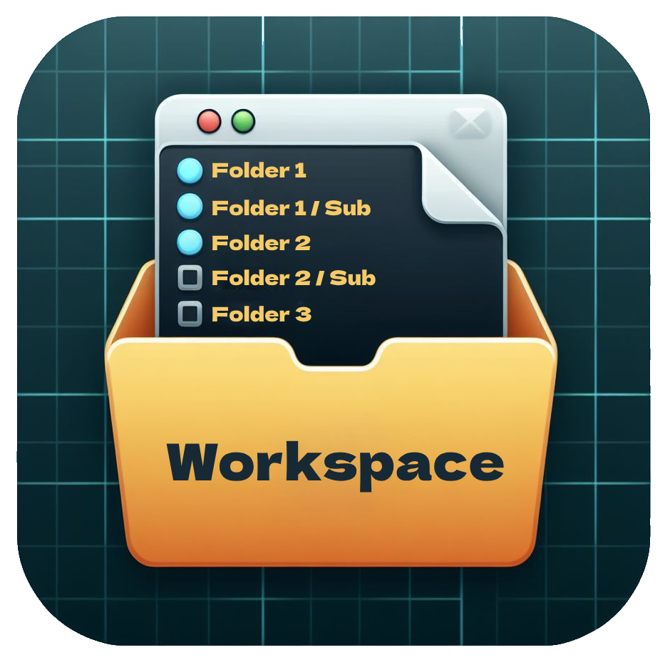
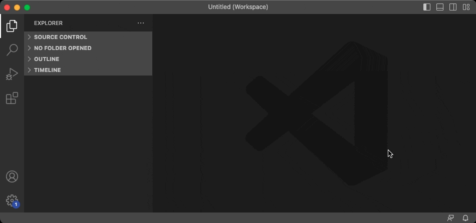
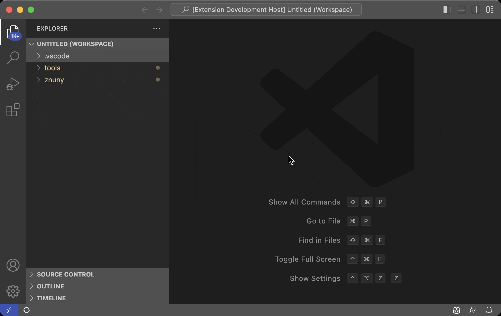
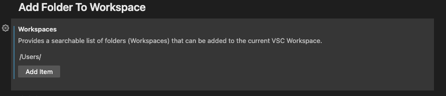

# AddFolderToWorkspace



**AddFolderToWorkspace** is an extension that adds / removes the selected folder (multiple) to / from the workspace (VSC Workspace).

```markdown
    Of course, you can use the already built-in function:
    `Workspaces: Add Folder To Workspace...`
    (workbench.action.addRootFolder).
    But then you have to click through all the folders again and again.
```

AddFolderToWorkspace is a Visual Studio Code extension that streamlines the process of adding and removing folders to and from your projects. It provides a set of commands and context menu options to manage your project's folder structure directly from the editor.

| Repository                                                                                                                                     | GitHub                                                                                                                                                                                                                                                              | Visual Studio Marketplace                                                                                                                                                                                                                                                      |
| ---------------------------------------------------------------------------------------------------------------------------------------------- | ------------------------------------------------------------------------------------------------------------------------------------------------------------------------------------------------------------------------------------------------------------------- | ------------------------------------------------------------------------------------------------------------------------------------------------------------------------------------------------------------------------------------------------------------------------------ |
|                        |                              |   |
|                                           |   |                                                                                                                           |
|  |                                                                                                                                                      |          |
|                    |                                                                                                                                           |                                       |

| Status |
| --- |
| [](https://github.com/dennykorsukewitz/VSCode-AddFolderToWorkspace/compare/2.1.0...dev)     |

## Feature

### AddFolderToWorkspace

This Function provides a searchable list of folders (Workspaces) that can be added **simultaneous** to the current VSC Workspace. All configured folders will be displayed.

**Shortcut:** ```strg + alt + k, p```<br>
**Command:**  ```AddFolderToWorkspace: Add Folder to Workspace.```



### RemoveFolderFromWorkspace

This Function provides a searchable list of folders (Workspaces) that can be removed **simultaneous** from the current VSC Workspace. All current open folders are displayed.

**Shortcut:** ```strg + alt + k, shift + p```<br>
**Command:**  ```AddFolderToWorkspace: Remove Folder from Workspace.```



### Add Recent Folders to Workspace

Opens a quick pick of **globally saved recent folder paths** (built from folders you previously added successfully with this extension). You can add one or many without going through the full configured-folder list. Does **not** require `workspaces` / `recursiveWorkspaces` to be set.

**Shortcut:** ```ctrl + alt + k, r``` (```cmd + alt + k, r``` on macOS where the keybinding resolves similarly)<br>
**Command:** ```AddFolderToWorkspace: Add Recent Folders to Workspace.```

### Clear Recent Folders List

Clears every entry from the global recent-folder history (the same list used by **Add Recent Folders** and the pinned section of **Add Folder to Workspace**).

**Command:** ```AddFolderToWorkspace: Clear Recent Folders List.``` (no default keybinding; assign one in Keyboard Shortcuts if you like.)

### Settings

`Preferences -> Settings -> Extensions -> AddFolderToWorkspace`

| Name                                     | Description                                                                                                                                                                              | Default Value |
| ---------------------------------------- | ---------------------------------------------------------------------------------------------------------------------------------------------------------------------------------------- | ------------- |
| addFolderToWorkspace.position            | If position is 'Top', the new folder will be added at the beginning of the current workspace. If position is 'Bottom', the new folder will be added at the end of the current workspace. | Bottom        |
| addFolderToWorkspace.workspaces          | Provides a list of folders (Workspaces) that can be added to the current VSC Workspace.                                                                                                  | /Users/       |
| addFolderToWorkspace.recursiveWorkspaces | Provides a searchable (only first level) list of folders  (Workspaces) that can be added to the current VSC Workspace.                                                                   | /Users/       |
| addFolderToWorkspace.recentFoldersCount  | How many recently added folders to pin at the top of the **Add Folder to Workspace** quick pick. Set to `0` to hide that section and stop persisting recent paths.                       | 5             |



---

## Installation

To install this extension, you have **three** options:

### 1. Search Extension in Marketplace

Search and install the extension via the Visual Studio Code extensions view (**View → Extensions** or activity bar).
Search for **AddFolderToWorkspace** or **Add Folder To Workspace**.

### 2. Install via vsix file

Download the latest [.vsix from Releases](https://github.com/dennykorsukewitz/VSCode-AddFolderToWorkspace/releases). In Visual Studio Code: **Extensions** view → **···** (Views and More Actions) → **Install from VSIX…**.

### 3. Source code

Download archive with the latest [release](https://github.com/dennykorsukewitz/VSCode-AddFolderToWorkspace/releases) and unpack it to Visual Studio Code extensions folder
`$HOME/.vscode/extensions/`.

---

## Download

For download see [VSCode-AddFolderToWorkspace](https://github.com/dennykorsukewitz/VSCode-AddFolderToWorkspace/releases)

---

Enjoy!

Your [Denny Korsukéwitz](https://github.com/dennykorsukewitz) 🚀
