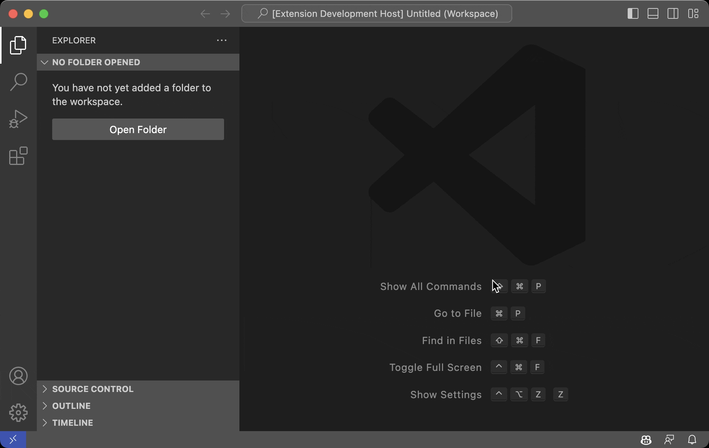

# AddFolderToWorkspace

**AddFolderToWorkspace** is an extension that adds the selected folder to the workspace (VSC Workspace).

| Repository | GitHub | Visual Studio Marketplace |
| ------ | ------ | ------ |
|  |   |   |
|  |   |  |
|   |  |   |
|   |  |   |

| Status |
 | ------ |
| [](https://github.com/dennykorsukewitz/VSCode-AddFolderToWorkspace/compare/1.1.1...dev)  [](https://github.com/dennykorsukewitz/VSCode-AddFolderToWorkspace/actions/workflows/snippet.yml)  |

## Feature

This Function provides a searchable list of folders (Workspaces) that can be added to the current VSC Workspace. All configured folders will be displayed.

**Shortcut:** ```strg + alt + z, p```<br>
**Command:**  ```AddFolderToWorkspace: Add Folder to Workspace.```

#### Settings

`Preferences -> Settings -> Extensions -> AddFolderToWorkspace`

| Name | Description | Default Value |
| - | - | - |
| addFolderToWorkspace.workspaces | All searchable Workspaces. | /workspace/ |



---

## Installation

To install this extension, you have **three** options:

### 1. Search Extension in Marketplace

Search and install online extension via VSC extensions menu.

`Code` -> `Preferences` -> `Extensions` simply search for `AddFolderToWorkspace` to install.

### 2. Install via vsix file

Download latest [vsix file](https://github.com/dennykorsukewitz/VSCode-AddFolderToWorkspace/releases) and install via extensions menu.

`Code` -> `Preferences` -> `Extensions` -> `Views and More Action` -> `Install from VSIX`.

### 3. Source code

Download archive with the latest [release](https://github.com/dennykorsukewitz/VSCode-AddFolderToWorkspace/releases) and unpack it to VisualStudioCode extensions folder
`$HOME/.vscode/extensions/`.

---

## Download

For download see [VSCode-AddFolderToWorkspace](https://github.com/dennykorsukewitz/VSCode-AddFolderToWorkspace/releases)

---

Enjoy!

Your [Denny Korsukéwitz](https://github.com/dennykorsukewitz) 🚀
